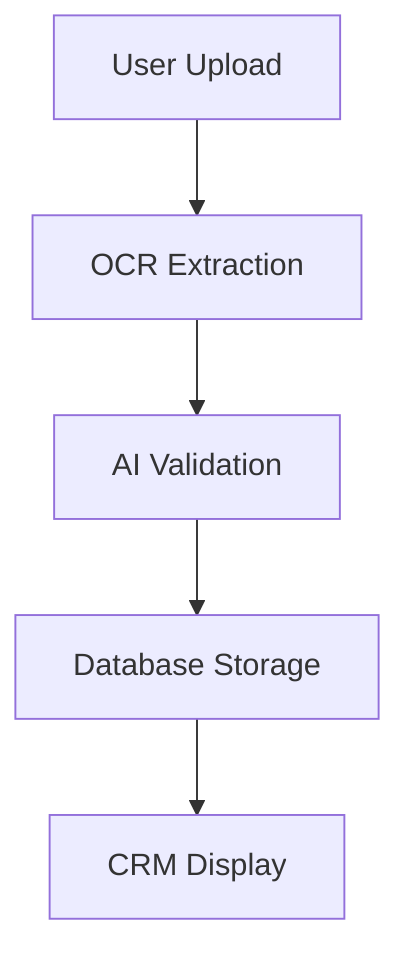

# GoBingo CRM Automation System

## Table of Contents
1. [System Overview](#system-overview)
2. [Key Components](#key-components)
3. [Architecture Flow](#architecture-flow)
4. [Technical Specifications](#technical-specifications)
5. [Installation & Setup](#installation--setup)
6. [Configuration](#configuration)
7. [API Endpoints](#api-endpoints)
8. [Usage Examples](#usage-examples)
9. [Maintenance](#maintenance)
10. [Contributors](#contributors)
11. [License](#license)

---

## System Overview 
An integrated CRM solution combining document processing, AI validation, and browser automation for insurance form submissions. The system features:

- OCR-based document processing
- AI-powered data validation
- Playwright automation engine
- Next.js dashboard interface
- PostgreSQL database backend
- Role-based access control
- Automated status tracking

---

## Key Components 

| Component        | Description                                                                 |
|-------------------|-----------------------------------------------------------------------------|
| **AI ChatBot**    | Handles natural language processing and data validation                    |
| **OCR Service**   | Processes ID Cards, Log Cards, and Licenses using Tesseract OCR            |
| **Database**      | PostgreSQL database storing structured user data                           |
| **CRM Interface** | Next.js 14 frontend with Shadcn UI components                              |
| **Automation**    | Playwright-based browser automation for form submissions                  |
| **API Gateway**   | Next.js API routes handling system integration                             |
| **Scheduler**     | Cron jobs for maintenance tasks and automation triggers                   |

---

## Architecture Flow 

### Document Processing Pipeline

# Navigate to backend directory
cd backend

# Create virtual environment
python -m venv venv

# Activate environment (Linux/Mac)
source venv/bin/activate

# Activate environment (Windows)
.\venv\Scripts\activate

# Install Python dependencies
pip install -r requirements.txt

# Install Playwright browsers
playwright install

# Navigate to frontend directory
cd frontend

# Install Node.js dependencies
npm install

# Configure environment variables
cp .env.example .env.local

## Contributors 
- [**Carl Saginsin**](https://carlsaginsin.vercel.app/) - Lead Software Engineer, UI Designer & System Architect

